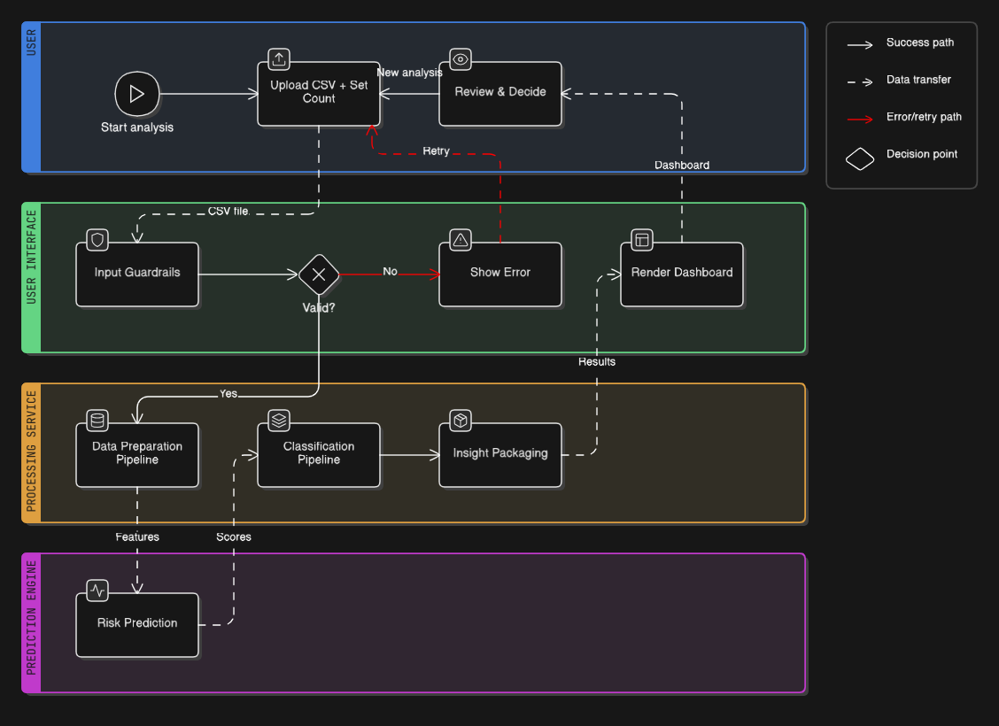
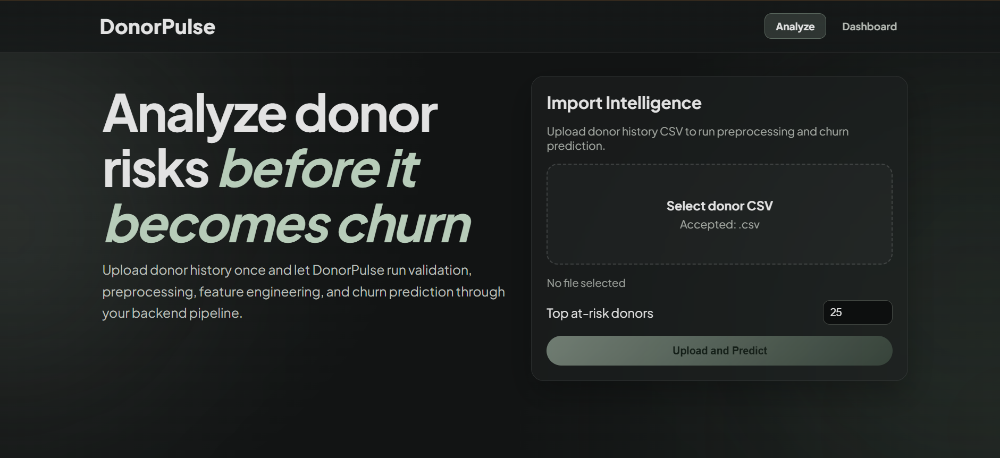
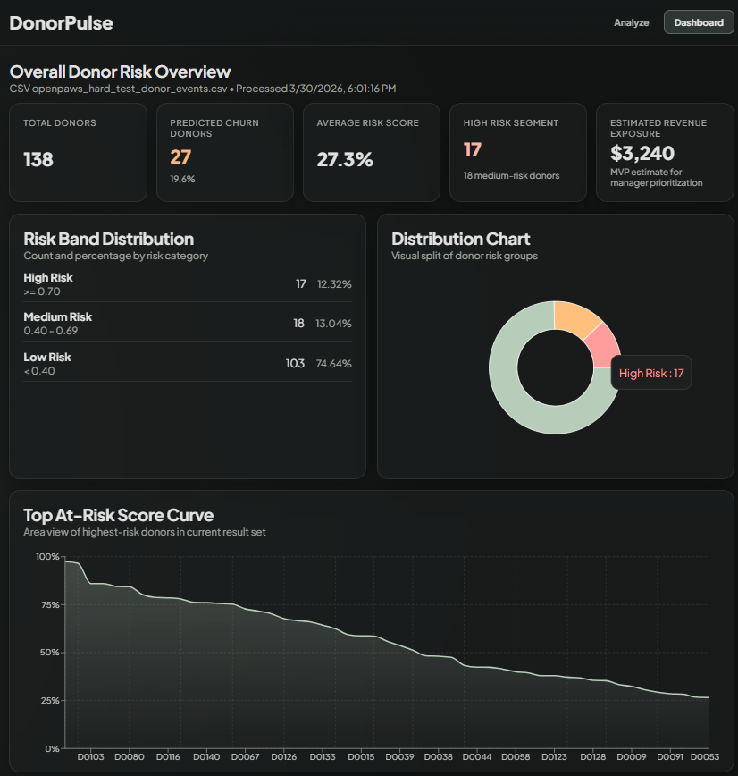
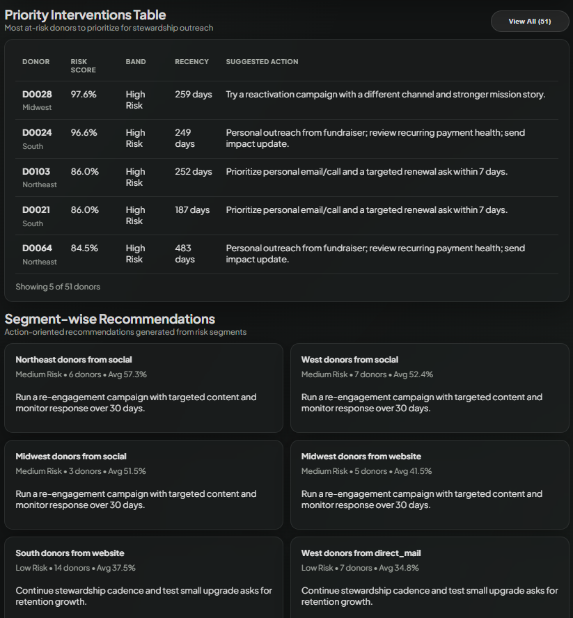

# DonorPulse - Donor Churn Risk Intelligence

DonorPulse is an end-to-end donor retention intelligence system that helps fundraising teams identify donors at risk of churn before loss happens. It provides CSV-based bulk analysis, risk scoring, intervention prioritization, and dashboard-ready insights for action.

This repository contains:
- A web dashboard for analysis and decision support
- A processing layer that validates and transforms uploaded donor event data
- A prediction engine that scores churn risk and produces intervention-focused outputs
- Training scripts for baseline and main model development

## Table of Contents
- [Project Overview](#project-overview)
- [System Workflow](#system-workflow)
- [Product Glimpse](#product-glimpse)
- [Core Features](#core-features)
- [Technologies Used](#technologies-used)
- [Installation](#installation)
- [Run the Project](#run-the-project)
- [Model Training](#model-training)
- [Columns Used for Training](#columns-used-for-training)
- [Input CSV Requirements for Prediction (Min and Max)](#input-csv-requirements-for-prediction-min-and-max)
- [Testing Datasets](#testing-datasets)
- [Prediction Output to Dashboard](#prediction-output-to-dashboard)
- [Repository Structure](#repository-structure)

## Project Overview
DonorPulse takes donor event history as CSV input and runs a complete scoring workflow:
1. Upload and validate donor event data
2. Preprocess and engineer donor-level features
3. Score churn probability per donor
4. Classify risk levels and generate recommendations
5. Render actionable dashboard views for fundraising teams

It is designed for practical decision support:
- Which donors need immediate outreach?
- Which donor segments need campaign-level intervention?
- What retention risk trend is currently visible?

## System Workflow
The diagram below summarizes the full flow from upload to dashboard rendering.



## Product Glimpse

### 1) Analyze page


### 2) Dashboard overview (risk summary and charting)


### 3) Priority interventions and segment recommendations


## Core Features
- CSV upload driven donor churn analysis
- Input guardrails for required schema and date correctness
- Automated preprocessing and feature preparation
- Donor-level churn probability scoring
- Risk banding (high, medium, low)
- Top at-risk donor ranking for outreach prioritization
- Segment-wise recommendation generation
- Engagement insight generation for manager actions
- Executive briefing summary for rapid decision making

## Technologies Used

### Frontend
- React
- React Router
- Recharts
- Vite

### Backend
- Node.js
- TypeScript
- Express
- Multer
- Zod

### Data and ML
- Python
- pandas
- numpy
- scikit-learn
- CatBoost
- joblib

## Installation

### Prerequisites
- Node.js 18+
- Python 3.10+

### 1) Clone and enter project
```bash
git clone (https://github.com/1prasadjr/DonorPulse.git)
cd DRP-Openpaws
```

### 2) Setup backend
```bash
cd Server
npm install
python -m pip install -r requirements.txt
```

### 3) Setup frontend
```bash
cd ../Client
npm install
```

## Run the Project

### Start backend
```bash
cd Server
npm run dev
```

### Start frontend
```bash
cd Client
npm run dev
```

Frontend runs on Vite dev server and connects to backend for upload + scoring orchestration.

## Model Training

### Model A - baseline
**LogisticRegression**
- Gives interpretability
- Fast to train
- Easy to explain

### Model B - main model
**CatBoostClassifier**
- Better ranking quality and better churn probability calibration
- Selected as the production scoring model

### Model comparison criteria
Models are compared on:
- ROC-AUC
- PR-AUC
- Recall for top-risk donors
- Precision in top risk buckets (for example top 10% / top 20% operational review)

### Current training result snapshot
Using the latest saved training metrics:

| Model | Validation ROC-AUC | Validation PR-AUC | Test ROC-AUC | Test PR-AUC | Selected |
|---|---:|---:|---:|---:|---|
| Logistic Regression | 0.8354 | 0.6906 | 0.8234 | 0.6512 | No |
| CatBoost | 0.9574 | 0.8762 | 0.9246 | 0.8127 | Yes |

Training artifacts are written under [Server/models](Server/models).

## Columns Used for Training

### Excluded from training
These columns are not included in X:
- donor_id
- snapshot_date
- churned_in_next_180d

### Used in training
All remaining engineered feature columns:
- days_since_last_donation
- donations_last_30d
- donations_last_90d
- donations_last_180d
- donations_last_365d
- total_amount_last_90d
- total_amount_last_180d
- total_amount_last_365d
- lifetime_donation_count
- lifetime_donation_amount
- avg_gift_amount
- max_gift_amount
- gift_amount_trend_90d_vs_prev_90d
- donation_count_trend_90d_vs_prev_90d
- days_since_last_communication
- communications_last_30d
- communications_last_90d
- communications_last_180d
- communications_last_365d
- open_rate_last_90d
- click_rate_last_90d
- reply_rate_last_180d
- attendance_rate_last_365d
- converted_communications_last_180d
- donor_tenure_days
- preferred_campaign_source
- acquisition_source
- donor_region
- is_recurring_donor

### Label
- churned_in_next_180d

## Input CSV Requirements for Prediction (Min and Max)
To run prediction successfully, DonorPulse validates raw donor event CSV input with required and optional fields.

### Minimum columns required (7)
These are mandatory:
- donor_id
- event_date
- event_type
- donor_since_date
- acquisition_source
- donor_region
- is_recurring_donor

### Full supported input columns (15)
This is the maximum built-in schema recognized by the current pipeline:

Required (7) + Optional (8):
- event_id
- amount_usd
- campaign_source
- was_opened
- was_clicked
- was_replied
- was_attended
- converted_to_donation

If optional columns are missing, defaults are auto-filled during preprocessing.

### Min/Max summary
- **Minimum needed to score**: 7 columns
- **Maximum recognized by pipeline schema**: 15 columns
- Additional extra columns can be present, but they are not used in feature computation.

### Recommended full header (15 columns)
```csv
event_id,donor_id,event_date,event_type,amount_usd,campaign_source,was_opened,was_clicked,was_replied,was_attended,converted_to_donation,donor_since_date,acquisition_source,donor_region,is_recurring_donor
```

### Strict minimum header (7 columns)
```csv
donor_id,event_date,event_type,donor_since_date,acquisition_source,donor_region,is_recurring_donor
```

### Event type guidance
Expected event categories include donation and communication events. Typical values:
- donation
- email
- sms
- phone_call
- direct_mail
- event

## Testing Datasets
Three sample datasets are included for end-to-end testing in:

- [docs/datasets/Donors data1.csv](docs/datasets/Donors%20data1.csv)
- [docs/datasets/Donors data2.csv](docs/datasets/Donors%20data2.csv)
- [docs/datasets/Donors data3.csv](docs/datasets/Donors%20data3.csv)

You can use these files directly from the Analyze page upload flow to verify:
- CSV validation and preprocessing behavior
- Risk scoring and dashboard rendering
- Segment recommendations and manager briefing output

## Prediction Output to Dashboard
After scoring, the system returns structured outputs used by the dashboard:
- Summary metrics (total donors, predicted churn donors, predicted churn rate)
- Risk distribution bands
- Top at-risk donor list
- Segment recommendations
- Engagement insights
- Manager summary and action notes

## Repository Structure
```text
Client/   -> Web UI (Analyze + Dashboard)
Server/   -> Upload orchestration, validation, and inference bridge
ML/       -> Feature-building and model training scripts
docs/     -> Visual assets used in documentation
```

---

If you are evaluating this project for implementation quality, start with:
1. The workflow diagram and screenshots above
2. [Server/python/infer_donor_churn.py](Server/python/infer_donor_churn.py) for runtime pipeline behavior
3. [ML/scripts/train_churn_model.py](ML/scripts/train_churn_model.py) for training and model selection logic
